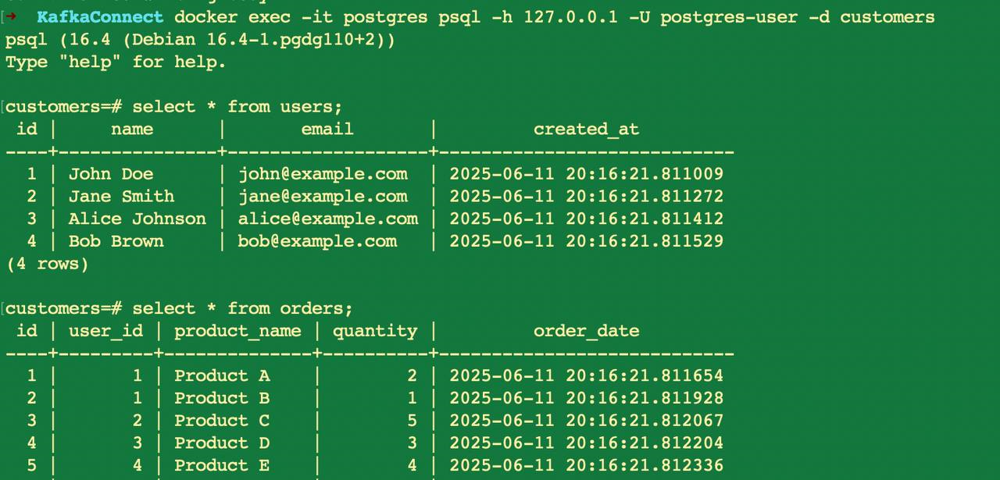
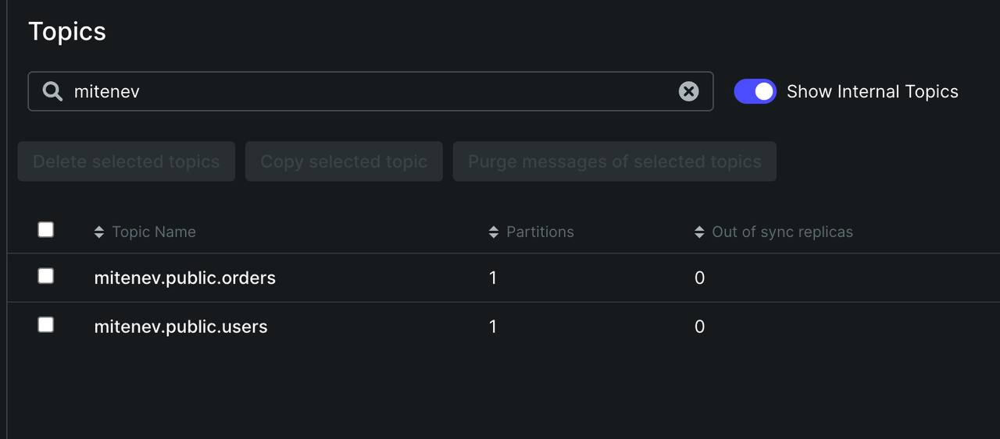
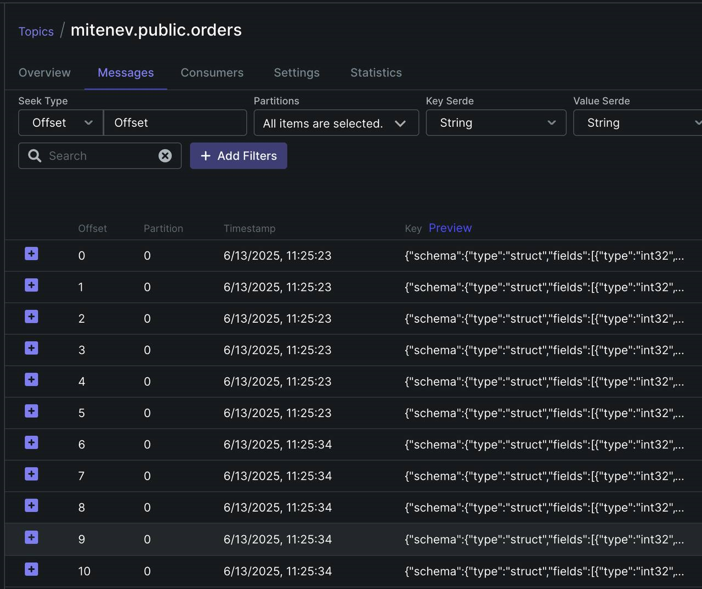

# Kafka-Connect

## Развернуть инфрастуктуру 

```bash
docker-compose up -d
```

Docker-compose включает в себя брокер Kafka, базу данных Postgres, KafkaConnect, Kafka-UI - интерфейс для удобной работы с Kafka
KAFKA_CFG_AUTO_CREATE_TOPICS_ENABLE: true - параметр, который разрешает Kafka создавать топики автоматически

### Проверить базу данных
Скрипт init.sql создает таблицы для базы данных и заполянет их

Подключиться к БД с помощью psql
docker -exec -it postgres psql -h 127.0.0.1 -U admin -d shop

Выполнить 2 селекта
SELECT * FROM users;
SELECT * FROM orders;

Будет отображено 



### Проверить, что драйвер был добавлен в Kafka-Connect

```bash
curl -I http://localhost:8083/connnector-plugins | jq
```
Вывод

    {
        "class": "io.debezium.connector.postgresql.PostgresConnector",
        "type": "source",
        "version": "3.1.2.Final"
    }

### Настроить коннектор 

    curl -X POST -H 'Content-Type: application.json' --data @connector.json http://localhost:8083/connectors


### Проверить сообщения в новых топиках

В интерфейсе KafkaUI localhost:8080 можно проверить, что новые топики были созданы


А так же в них попали сообщения о записях в БД


## Вы молодец! Kafka-Connect настроена

